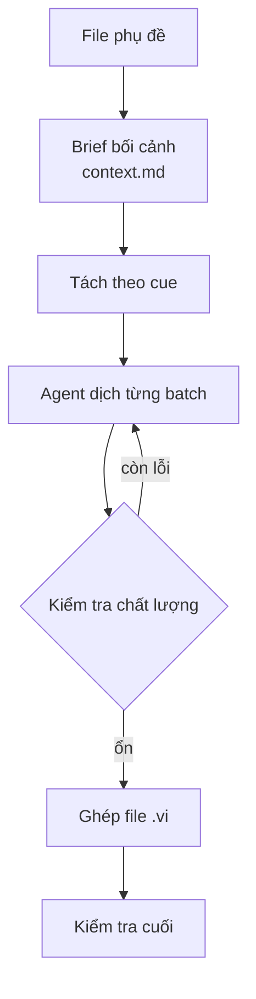

# vietsub — Skill dịch phụ đề

Cursor Agent Skill dịch phụ đề **SRT** và **ASS/SSA** sang **tiếng Việt**. Agent (LLM) là người dịch — không dùng Google Translate hay dịch máy.

Hỗ trợ macOS, Linux, Windows · Python 3.10+ · Định dạng SRT / ASS / SSA

---

## Vì sao cần skill này?

Dịch máy thường làm hỏng timing, tag hiển thị, và đặc biệt là **xưng hô** tiếng Việt. Skill này giữ cấu trúc phụ đề nguyên vẹn, đồng thời cho agent đủ ngữ cảnh để dịch tự nhiên và nhất quán cả phim.

| Được gì | Tránh được gì |
|---------|---------------|
| Timing và tag giữ nguyên | Vỡ timestamp, hỏng tag ASS |
| Xưng hô đúng quan hệ nhân vật | Sai đại từ, "bạn" khắp nơi |
| Giọng và register ổn định | Văn phong lệch giữa các đoạn |
| Bản dịch do agent, có brief rõ | Văn máy, thiếu ngữ cảnh |

---

## Luồng làm việc



| Bước | Việc chính | Kết quả |
|------|------------|---------|
| 1 | Kiểm tra encoding, research phim, viết brief | `context.md` (+ `glossary.md` nếu cần) |
| 2 | Tách phụ đề thành các batch nhỏ | Batch JSON + metadata |
| 3 | Agent dịch lần lượt từng batch | Bản dịch tiếng Việt từng cue |
| 4 | Kiểm tra giữa chừng và trước khi ghép | Bắt lỗi sớm |
| 5 | Soát các cảnh quan trọng | Đối chiếu nguồn / bản dịch |
| 6 | Ghép lại thành file phụ đề hoàn chỉnh | `.vi.srt` hoặc `.vi.ass` |
| 7 | Kiểm tra lần cuối | Sẵn sàng xem |

Có thể dịch thử một đoạn phim trước, hoặc tiếp tục job bị ngắt giữa chừng.

---

## Tính năng

- **Agent-only** — chỉ LLM dịch nội dung; script lo phần cơ học
- **Brief theo phim** — nhân vật, xưng hô, phase câu chuyện, thuật ngữ, cảnh then chốt
- **Tách theo cue** — không dịch cả file theo dòng thô
- **Kiểm tra xưng hô** — phát hiện đại từ / giọng sai trước khi ghép
- **Chống hỏng bản dịch** — bắt tag và text bị vỡ do xử lý sai
- **Preflight encoding** — phát hiện file GBK/UTF-8 lỗi sớm
- **Glossary tách riêng** — brief gọn, thuật ngữ dài để file riêng
- **ASS karaoke** — tự điều chỉnh kích thước batch khi nhiều nhạc / `\k`
- **Resume** — nhớ batch đã xong nếu phiên bị gián đoạn

---

## Chống chỉ định

Ngôi thứ và **xưng hô không thể chính xác hoàn toàn**. Phụ đề gốc (đặc biệt tiếng Anh/Nhật…) thường không ghi rõ ai đang nói với ai, cũng không ghi quan hệ nhân vật — agent chỉ suy luận từ ngữ cảnh và `context.md`, nên đôi khi nhầm người nói / người nghe hoặc chọn đại từ sai.

Skill giảm lỗi (brief, audit, spot-check) nhưng **không thay** việc research phim và soát tay các cảnh quan trọng trước khi phát hành bản dịch.

---

## Dùng trong agent

1. Gắn hoặc mở file phụ đề (`.srt`, `.ass`, `.ssa`).
2. Nhắn agent, ví dụ: *Dùng skill vietsub dịch phụ đề này, tên phim là …*
3. Agent chạy pipeline và trả file `.vi`.

Skill **không tự bật** — gọi khi cần dịch phụ đề. Dùng được trên **Cursor**, **Claude Code**, **Antigravity**.

---

## Cài đặt

Repo: [github.com/viet241/vietsub-translation-skill](https://github.com/viet241/vietsub-translation-skill)

**Yêu cầu:** Node.js (`npx`), Python 3.10+.

```bash
npx skills add viet241/vietsub-translation-skill -g
```

Chỉ Cursor: thêm `-a cursor`. Dependency Python do agent tự cài khi chạy skill lần đầu.

| Tool | Thư mục cài |
|------|-------------|
| Cursor | `~/.cursor/skills/vietsub` |
| Claude Code | `~/.claude/skills/vietsub` |
| Antigravity (global) | `~/.gemini/config/skills/vietsub` |
| Antigravity (project) | `.agents/skills/vietsub` |

Gọi trong chat: `/vietsub` (Cursor, Claude Code).

### Gỡ

```bash
npx skills remove vietsub -g
```

**Lưu ý:** Chỉ xóa thư mục skill. **Không** gỡ package Python. **Không** xóa folder job dịch (`movie_batches/`, file `.vi.srt`) — xóa tay nếu không cần.

---

Chi tiết workflow cho agent: [SKILL.md](SKILL.md).
